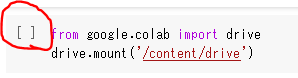
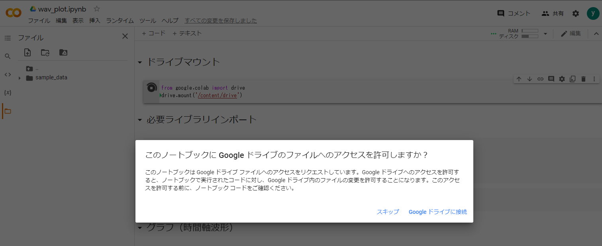
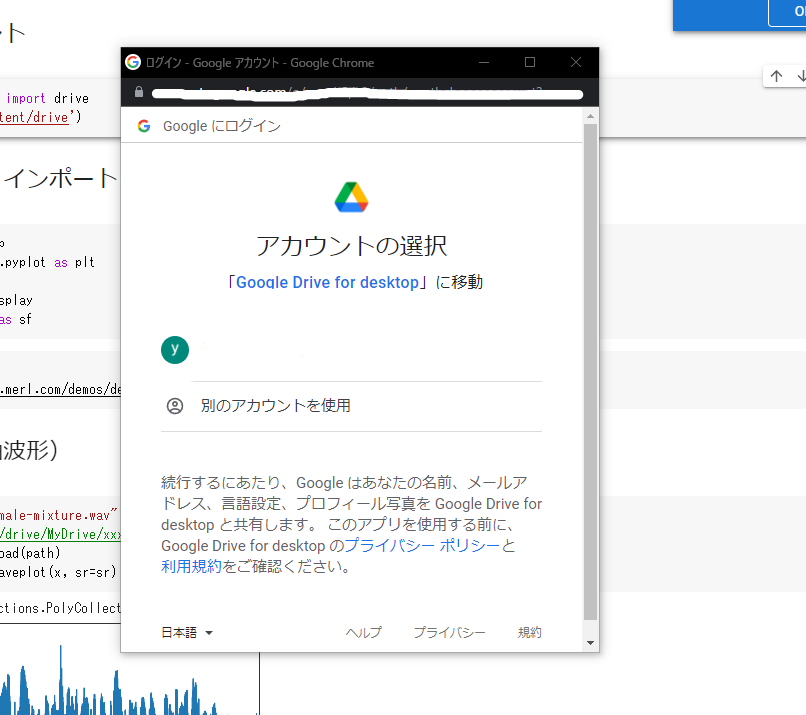
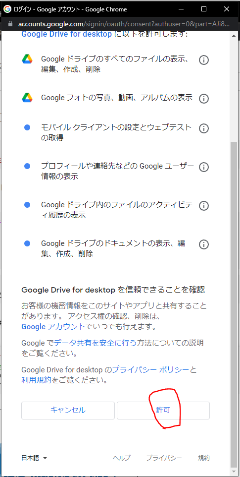
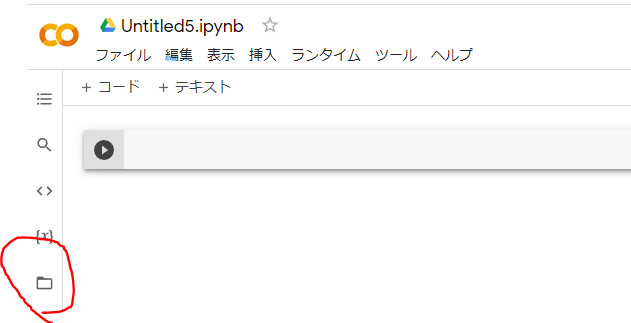
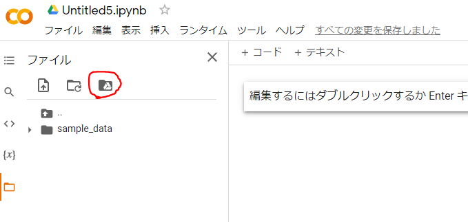
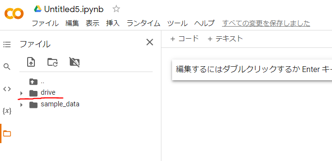

# Googleドライブのマウント方法

## Colaboratory 上の操作
Colaboratory 上で [ ] を押下すると、接続認証が開始します  
# 

## 接続・アカウント選択
接続認証が開始し、アカウント選択画面へ遷移します  
# 
# 

許可を押下してください  
# 

## マウント完了
下記の図の通り、Googleドライブのディレクトリが選択できるか確認してください

# 
# 

"drive" と書かれたアイコンを選択すると、Googleドライブのファイル一覧が表示されます  
# 

